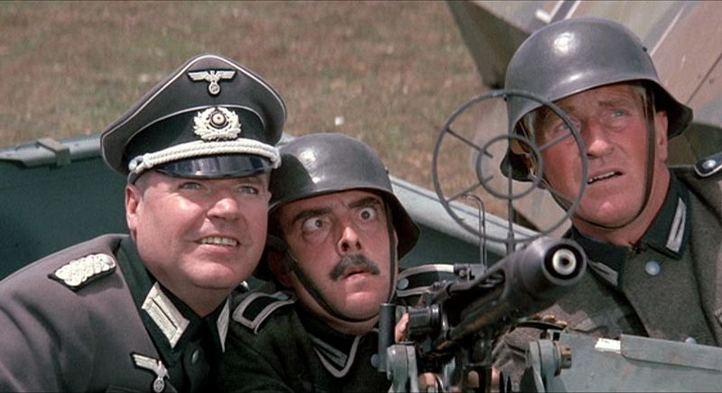

# AA-bot

Simple Anti-Air game with RL-agent





## Requirements
```
pip install -r requirements.txt
```

Run this to check environment
```
python3 src/check_env.py
```

## Training
set variables TIMESTEPS, EPOCHS in src/train_PPO.py

set variable UNIX_SERVER=True in src/aaEnv.py to enable training on UNIX server
```
python3 src/train_PPO.py
```
see training results in tensorboard
```
tensorboard --logdir=logs
```

## Usage
Play game:
```
python3 src/play.py
```
Press A and D to turn left and right. Space to shot.

Test agent:
set variable TIMESTEPS in src/test_PPO.py
```
python3 src/test_PPO.py
```

Project Organization
------------

    ├── LICENSE
    │
    ├── README.md          <- README for developers
    │
    ├── docs               <- Documentation
    │
    ├── logs               <- Training logs for tensorboard
    │
    ├── models             <- Trained models
    │
    ├── references         <- Data dictionaries, manuals, and all other explanatory materials.
    │
    ├── requirements.txt   <- The requirements file for reproducing the analysis environment, e.g.
    │                         generated with `pip freeze > requirements.txt`
    └── src                <- Source code for use in this project.
